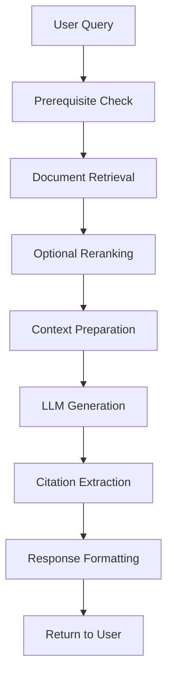

# System Architecture

This document describes the architecture and design of the Cerebras Documentation RAG System.

## Overview

The Cerebras RAG system is built with a modular architecture that separates concerns into distinct components:

```
Cerebras RAG System
├── User Interfaces
│   ├── CLI Interface (Rich terminal UI)
│   └── Programmatic API
├── Core Agent Layer
│   ├── RAG Agent (orchestration)
│   ├── LLM Integration (Cerebras/Qwen)
│   └── Memory Management (LangGraph)
├── Data & Retrieval Layer
│   ├── Vector Database (Pinecone)
│   ├── Embeddings (Cohere)
│   └── Document Processing
└── Supporting Components
    ├── Configuration Management
    ├── Citation System
    └── Utilities
```

## Core Components

### 1. Agent Layer (`src/cerebras_rag/agents/`)

The agent layer contains the core business logic and orchestration.

#### CerebrasRAGAgent (`rag_agent.py`)

```python
class CerebrasRAGAgent:
    """Main orchestrator for RAG operations"""
    
    # Core components
    vector_store: PineconeVectorStore
    llm: ChatOpenAI  # Configured for Cerebras
    graph: LangGraph  # Conversation memory
    memory: MemorySaver  # Persistent storage
```

**Responsibilities:**
- Orchestrate the RAG pipeline
- Manage vector store connections
- Handle conversation memory
- Coordinate citation generation
- Process streaming responses

**Key Methods:**
- `ask_question()`: Main query interface
- `stream_response_with_citations()`: Real-time responses
- `retrieve_with_citations()`: Document retrieval
- `generate_with_citations()`: Answer generation

#### Data Models (`models.py`)

```python
class Citation(BaseModel):
    source_id: int
    quote: str

class QuotedAnswer(BaseModel):
    answer: str
    citations: List[Citation]
```

**Purpose:**
- Ensure structured, validated outputs
- Provide type safety for API responses
- Enable easy JSON serialization

### 2. Interface Layer (`src/cerebras_rag/interfaces/`)

User-facing interfaces for system interaction.

#### CLI Interface (`cli.py`)

```python
class CerebrasRAGCLI:
    """Professional command-line interface"""
    
    # Features
    - Rich terminal formatting
    - Real-time configuration
    - Conversation history
    - Command processing
    - Error handling
```

**Features:**
- Interactive question-answering
- Live configuration changes
- Session management
- Professional terminal UI
- Comprehensive help system

### 3. Utilities Layer (`src/cerebras_rag/utils/`)

Supporting utilities and scripts.

#### Vector Database Population (`populate_vectordb.py`)

**Purpose:**
- Process Cerebras documentation
- Generate embeddings
- Populate Pinecone index
- Manage document metadata

**Process Flow:**
1. Document collection and parsing
2. Text chunking and cleaning
3. Embedding generation (Cohere)
4. Vector database upload (Pinecone)
5. Metadata indexing

## Technology Stack

### Language Model Integration

```python
# Cerebras via OpenRouter
llm = ChatOpenAI(
    base_url=os.getenv("OPENROUTER_BASE_URL"),
    api_key=os.getenv("OPENROUTER_API_KEY"),
    model="qwen/qwen3-32b",
    extra_body={
        "provider": {
            "only": ["cerebras"]
        }
    }
)
```

**Model**: Qwen3-32B via Cerebras provider
**Benefits**: 
- High-speed inference
- Excellent instruction following
- Good reasoning capabilities

### Vector Database

```python
# Pinecone configuration
INDEX_NAME = "cerebras-docs"
DIMENSION = 1024  # Cohere embed-english-v3.0
METRIC = "cosine"
```

**Technology**: Pinecone managed vector database
**Configuration**:
- Embedding dimension: 1024 (Cohere v3.0)
- Distance metric: Cosine similarity
- Serverless deployment

### Embeddings

```python
embeddings = CohereEmbeddings(
    model="embed-english-v3.0",
    cohere_api_key=os.getenv("COHERE_API_KEY")
)
```

**Model**: Cohere embed-english-v3.0
**Benefits**:
- High-quality semantic representations
- Optimized for retrieval tasks
- Multi-language support

### Memory System

```python
# LangGraph conversation memory
graph_builder = StateGraph(MessagesState)
graph_builder.add_node("call_model", self._call_model)
self.memory = MemorySaver()
self.graph = graph_builder.compile(checkpointer=self.memory)
```

**Technology**: LangGraph with MemorySaver
**Benefits**:
- Persistent conversation state
- Thread-based isolation
- Checkpointing for reliability

## Data Flow

### Query Processing Pipeline



### Detailed Flow

1. **Input Validation**
   - Check API keys and prerequisites
   - Validate vector store connection
   - Initialize conversation context

2. **Document Retrieval**
   ```python
   # Semantic search
   docs = vector_store.similarity_search(query, k=6)
   
   # Optional reranking
   if use_reranking:
       docs = reranker.compress_documents(docs, query)
   ```

3. **Context Preparation**
   ```python
   # Format with source IDs for citation tracking
   context = format_docs_with_id(docs)
   ```

4. **Generation**
   ```python
   # Structured output with citations
   response = llm.with_structured_output(QuotedAnswer).invoke(prompt)
   ```

5. **Response Processing**
   ```python
   # Validate and return structured response
   return QuotedAnswer(answer=response.answer, citations=response.citations)
   ```

## Streaming Architecture

### Real-time Response Generation

```python
def stream_response_with_citations(self, question: str):
    """Stream responses with live citation tracking"""
    
    # Status updates
    yield {"type": "status", "message": "Retrieving documents..."}
    
    # Document retrieval
    docs = self.retrieve_with_citations(question)
    yield {"type": "status", "message": f"Found {len(docs)} documents"}
    
    # Streaming generation
    for chunk in llm.stream(prompt):
        yield {"type": "answer", "content": chunk.content}
    
    # Citation extraction
    for citation in extract_citations(response, docs):
        yield {"type": "citation", "source_id": citation.source_id, ...}
```

**Benefits:**
- Real-time user feedback
- Progressive response building
- Live citation tracking
- Better perceived performance

## Memory Management

### Conversation Threading

```python
# Thread-specific configuration
config = {"configurable": {"thread_id": "user_session_123"}}

# Persistent conversation state
response = agent.ask_question(
    question="What was my first question?",
    config=config
)
```

**Features:**
- Thread-based isolation
- Persistent conversation history
- Context-aware responses
- History retrieval capabilities

### State Management

```python
class MessagesState(TypedDict):
    messages: List[BaseMessage]

def _call_model(self, state: MessagesState):
    """Process conversation state through LLM"""
    response = self.llm.invoke(state["messages"])
    return {"messages": [response]}
```

## Error Handling

### Graceful Degradation

```python
try:
    # Primary operation
    response = agent.ask_question(question)
except APIConnectionError:
    # Fallback without reranking
    response = agent.ask_question(question, use_reranking=False)
except Exception as e:
    # Graceful error response
    return QuotedAnswer(
        answer=f"I apologize, but I encountered an error: {str(e)}",
        citations=[]
    )
```

### Error Categories

1. **Configuration Errors**: Missing API keys, invalid settings
2. **Network Errors**: API timeouts, connection failures
3. **Data Errors**: Empty vector store, missing documents
4. **Processing Errors**: Malformed responses, validation failures

## Security Considerations

### API Key Management

```python
# Environment variable loading
load_dotenv()

# Secure API key handling
api_key = os.getenv("OPENROUTER_API_KEY")
if not api_key:
    raise ConfigurationError("Missing OPENROUTER_API_KEY")
```

### Input Validation

```python
# Pydantic validation
class Citation(BaseModel):
    source_id: int = Field(..., ge=0)  # Non-negative integer
    quote: str = Field(..., min_length=1)  # Non-empty string
```

### Rate Limiting

- Respect API provider rate limits
- Implement exponential backoff
- Graceful degradation on limits

## Performance Optimization

### Caching Strategy

- Vector similarity results caching
- LLM response caching for repeated queries
- Document metadata caching

### Batch Processing

- Batch embedding generation
- Vectorized similarity computations
- Parallel document processing

### Resource Management

- Connection pooling for APIs
- Memory-efficient document chunking
- Lazy loading of large components

## Deployment Architecture

### Environment Configuration

```env
# Core API keys
OPENROUTER_API_KEY=your_key
PINECONE_API_KEY=your_key
COHERE_API_KEY=your_key

# Optional configurations
OPENROUTER_BASE_URL=https://openrouter.ai/api/v1
PINECONE_INDEX_NAME=cerebras-docs
```

### Scalability Considerations

- **Horizontal scaling**: Multiple agent instances
- **Load balancing**: Request distribution
- **Caching layers**: Redis for response caching
- **Monitoring**: Performance and error tracking

## Extension Points

### Custom Interfaces

```python
class CustomInterface:
    def __init__(self):
        self.agent = get_agent()
    
    def custom_query_method(self, query: str):
        # Custom logic here
        return self.agent.ask_question(query)
```

### Custom Document Sources

```python
class CustomDocumentLoader:
    def load_documents(self) -> List[Document]:
        # Custom document loading logic
        return documents
```

### Custom Embedding Models

```python
class CustomEmbeddings:
    def embed_documents(self, texts: List[str]) -> List[List[float]]:
        # Custom embedding logic
        return embeddings
```

This modular architecture enables easy extension and customization while maintaining clear separation of concerns and robust error handling throughout the system. 